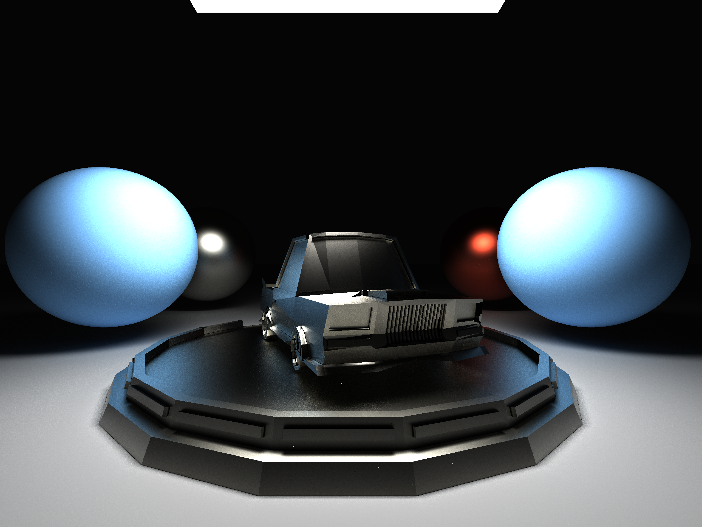

Basic Pathtracer Written in C supports 
diffuse, microfacet and dielectric materials, 
homogeneous media, 
NEE (Next Event Estimation) based pathspace importance sampling (for non participating media).


# Dependencies
The pathtracer itself does not use any external dependencies however for the purpose of displaying the current state of the image in a window GLFW, OpenGL and GLEW are used.
# Compiling on Linux
To build the executable run
```bash
$ cc -lm -lGL -lglfw -lGLEW -Iinclude -Ofast src/*.c -o sphere_tracer
```
where cc is the C compiler of choice e.g. gcc or clang.
Then you can run the Program with
```bash
./sphere_tracer
```
At the moment the scene has to be customized by changing the src/sphere_tracer.c file this will be changed in the future. 
